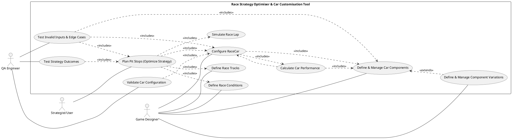
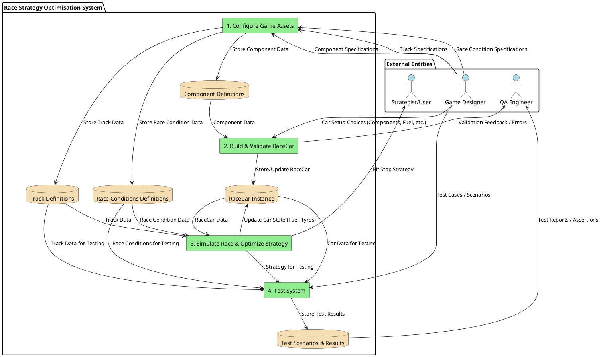

```plantuml
@startuml Use Case Diagram

left to right direction

actor "Game Designer" as GD
actor "Strategist/User" as User
actor "QA Engineer" as QA

rectangle "Race Strategy Optimiser & Car Customisation Tool" {
  usecase "Define & Manage Car Components" as UC1
  usecase "Define & Manage Component Variations" as UC1_1
  usecase "Configure RaceCar" as UC2
  usecase "Define Race Tracks" as UC3
  usecase "Define Race Conditions" as UC4
  usecase "Calculate Car Performance" as UC5
  usecase "Validate Car Configuration" as UC6
  usecase "Simulate Race Lap" as UC7
  usecase "Plan Pit Stops (Optimize Strategy)" as UC8
  usecase "Test Strategy Outcomes" as UC9
  usecase "Test Invalid Inputs & Edge Cases" as UC10
}

GD -- UC1
GD -- UC1_1
GD -- UC2
GD -- UC3
GD -- UC4

UC1 <.. UC1_1 : <<extends>>
UC2 ..> UC1 : <<includes>>
UC2 ..> UC5 : <<includes>>
UC5 ..> UC1 : <<includes>> 
UC5 ..> UC2

User -- UC8
UC8 ..> UC2 : <<includes>>
UC8 ..> UC3 : <<includes>>
UC8 ..> UC4 : <<includes>>
UC8 ..> UC7 : <<includes>>

QA -- UC6
QA -- UC9
QA -- UC10
UC6 ..> UC2 : <<includes>>
UC9 ..> UC8 : <<includes>>
UC10 ..> UC1 : <<includes>>
UC10 ..> UC2 : <<includes>>
UC10 ..> UC8 : <<includes>>


@enduml
```

```plantuml
@startuml Data Flow Diagram (Level 1)

!define ENTITY_COLOR #LightBlue
!define PROCESS_COLOR #LightGreen
!define DATASTORE_COLOR #Wheat

skinparam defaultTextAlignment center

package "External Entities" {
  actor "Game Designer" as GD ENTITY_COLOR
  actor "Strategist/User" as SU ENTITY_COLOR
  actor "QA Engineer" as QA ENTITY_COLOR
}

package "Race Strategy Optimisation System" {
  rectangle "1. Configure Game Assets" as P1 PROCESS_COLOR
  rectangle "2. Build & Validate RaceCar" as P2 PROCESS_COLOR
  rectangle "3. Simulate Race & Optimize Strategy" as P3 PROCESS_COLOR
  rectangle "4. Test System" as P4 PROCESS_COLOR

  database "Component Definitions" as DS_Comp DATASTORE_COLOR
  database "Track Definitions" as DS_Track DATASTORE_COLOR
  database "Race Conditions Definitions" as DS_Cond DATASTORE_COLOR
  database "RaceCar Instance" as DS_Car DATASTORE_COLOR
  database "Test Scenarios & Results" as DS_Test DATASTORE_COLOR
}

' Data Flows from Game Designer
GD --> P1 : Component Specifications
GD --> P1 : Track Specifications
GD --> P1 : Race Condition Specifications
GD --> P2 : Car Setup Choices (Components, Fuel, etc.)

' Process 1: Configure Game Assets
P1 --> DS_Comp : Store Component Data
P1 --> DS_Track : Store Track Data
P1 --> DS_Cond : Store Race Condition Data

' Process 2: Build & Validate RaceCar
DS_Comp --> P2 : Component Data
P2 --> DS_Car : Store/Update RaceCar
P2 --> QA : Validation Feedback / Errors

' Process 3: Simulate Race & Optimize Strategy
DS_Car --> P3 : RaceCar Data
DS_Track --> P3 : Track Data
DS_Cond --> P3 : Race Condition Data
P3 --> DS_Car : Update Car State (Fuel, Tyres)
P3 --> SU : Pit Stop Strategy

' Process 4: Test System
GD --> P4 : Test Cases / Scenarios
DS_Car --> P4 : Car Data for Testing
DS_Track --> P4 : Track Data for Testing
DS_Cond --> P4 : Race Conditions for Testing
P3 --> P4 : Strategy for Testing
P4 --> DS_Test : Store Test Results
DS_Test --> QA : Test Reports / Assertions

@enduml
```
